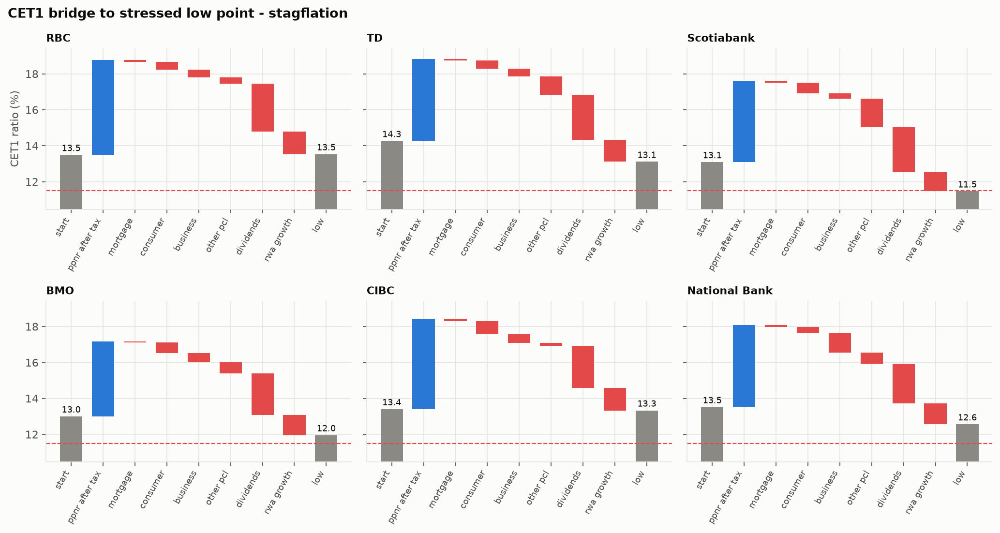
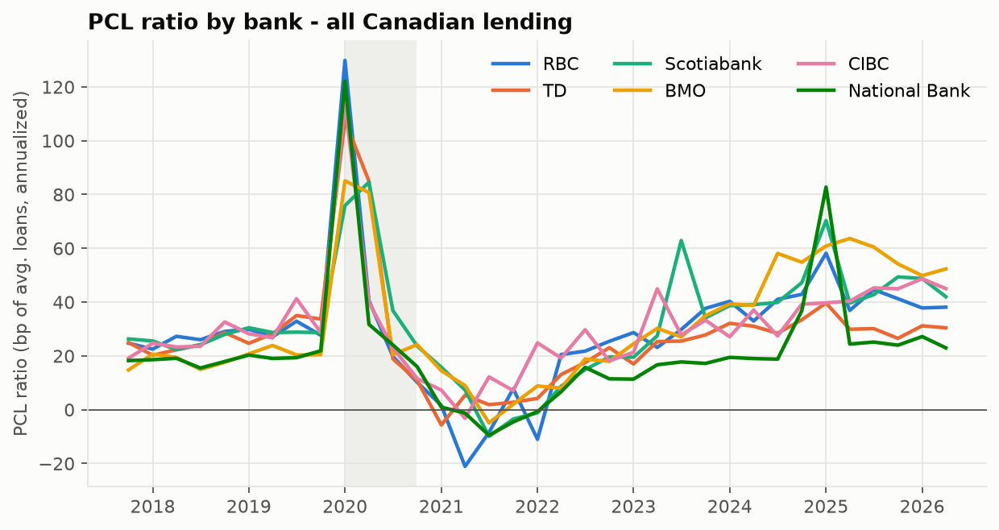
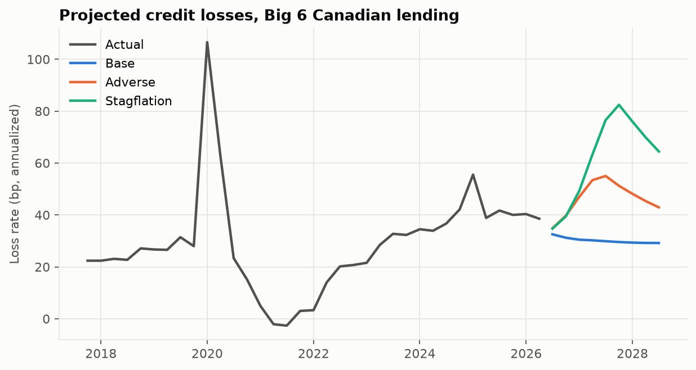

# Canadian Bank Credit Stress Test

Projects 9-quarter credit losses and CET1 capital impact for Canada's Big 6 banks (RBC, TD, Scotiabank, BMO, CIBC, National Bank) under base, adverse-recession and severe-stagflation scenarios, using two independent methods: a macro satellite regression and a Vasicek single-factor model.

> **Headline result.** Under a severe stagflation scenario (unemployment +4 pp to 10.7%, house prices −30%, policy rate +200 bp), the Big 6 lose **$43.5bn** on Canadian loans over 9 quarters (~140 bp of loans). **Scotiabank is most exposed**: CET1 falls 162 bp to 11.47%, just under OSFI's 11.5% expectation, driven by its international book and a thinner earnings cushion. **RBC is least exposed**: earnings absorb its losses and CET1 ends where it started. The most/least exposed banks are the same under both loss methods and with or without stress on non-Canadian books.



## Results

Jump-off FQ3 2026 (calendar 2026Q2). Headline method: average of the satellite regression and the Vasicek model.

| Rank | Bank | CET1 start | Stagflation low | Drawdown | Buffer vs OSFI 11.5% | Main driver | Adverse drawdown |
|---|---|---|---|---|---|---|---|
| 1 | Scotiabank | 13.1% | 11.47% | 162 bp | −3 bp | Non-Canadian book | 77 bp |
| 2 | TD | 14.3% | 13.1% | 116 bp | +161 bp | Non-Canadian book | 41 bp |
| 3 | BMO | 13.0% | 12.0% | 104 bp | +46 bp | Non-Canadian book | 39 bp |
| 4 | National Bank | 13.5% | 12.6% | 95 bp | +106 bp | Business | 15 bp |
| 5 | CIBC | 13.4% | 13.3% | 7 bp | +183 bp | Consumer | −10 bp |
| 6 | RBC | 13.5% | 13.5% | −4 bp | +203 bp | Business | −11 bp |

*Before earnings*, Canadian credit losses alone consume 96–150 bp of CET1 under stagflation. National Bank (150 bp) and CIBC (131 bp) are hit hardest because they are the most concentrated in Canada; their earnings power is what separates them.

**Canadian loss rates, 9-quarter cumulative (bp of loans):**

| Scenario | Mortgages + HELOCs | Consumer | Business | Total (C$bn) |
|---|---|---|---|---|
| Adverse recession | 12 | 399 | 153 | 32.7 |
| Severe stagflation | 23 | 490 | 208 | 43.5 |

**Robustness.** The ranking's top two (Scotiabank, TD) and bottom two (CIBC, RBC) are identical under the regression, the Vasicek model and their average. Holding non-Canadian PCL flat instead of stressing it shrinks drawdowns to −8…93 bp but keeps Scotiabank most and RBC least exposed. The two methods agree on base-case losses (Vasicek ÷ regression = 1.0–1.3×) and on stressed consumer losses (1.3–1.7×); for stressed mortgage and business losses Vasicek is 2.7–4.4× higher, because the regression has only one downturn to learn from (COVID), cushioned by government support.




## Method in one paragraph

Quarterly provisions for credit losses (PCL) from each bank's supplementary financial packages (fiscal 2018 onward, the IFRS 9 era) are mapped to three Canadian portfolios: mortgages/HELOCs, consumer and business. A panel regression with bank fixed effects links each portfolio's PCL ratio to lagged unemployment, GDP growth, house prices and the policy rate. A Vasicek model translates the same scenarios into stressed default rates as a cross-check. Projected losses, offset by after-tax pre-provision earnings, give each bank's CET1 path against OSFI's 11.5% D-SIB expectation.

## Run it

```bash
make setup      # venv + dependencies (also needs `pdftotext`: brew install poppler)
make packages   # download the banks' supplementary packages (~70 files, git-ignored)
make extract    # parse them into data/raw/banks/pcl_loans.csv and capital.csv
make macro      # pull BoC, StatCan, house prices (no API keys needed)
make banks      # build the panel from data/raw/banks/*.csv
make all        # regression -> scenarios -> projection -> capital -> charts
make test       # synthetic-data tests
```

Bank figures are extracted automatically from each bank's Supplementary Financial Information packages (Excel, and PDF for older TD, Scotiabank and BMO quarters); see [docs/data_collection.md](docs/data_collection.md). Assumptions live in [src/config.py](src/config.py) and judgment calls in [docs/decisions.md](docs/decisions.md). Project plan: [PLAN.md](PLAN.md).

## Repo layout

```text
data/
  raw/banks/            extracted PCL, loans, capital; IFRS 9 disclosures (CSV)
  raw/macro/            cached BoC / StatCan / BIS pulls
  portfolio_map.csv     bank label -> mortgage / consumer / business
  processed/            macro_quarterly, bank_panel, bank_capital, results_*
src/
  config.py             all assumptions
  fetch_packages.py     download SFI packages
  extract/              one parser per bank (+ shared SFI helpers)
  load_macro.py         BoC Valet, StatCan WDS, house prices
  load_banks.py         fiscal->calendar mapping, PCL ratios, validation
  regression.py         satellite model per portfolio
  scenarios.py          base / adverse / stagflation 9-quarter paths
  vasicek.py            stressed PDs, HPI-linked mortgage LGD, sensitivity
  capital.py            projection, CET1 path, waterfall, ranking
  benchmark.py          comparison with banks' IFRS 9 downside cases
  charts.py             figures
  run_all.py            end-to-end pipeline
notebooks/analysis.ipynb
reports/                stress_test_report.pdf, sector_view.pdf, figures/
tests/
```

## Data sources

Bank Supplementary Financial Information and Pillar 3 reports; annual reports (IFRS 9 notes); Statistics Canada (tables 14-10-0287, 36-10-0104); Bank of Canada Valet API; BIS residential property prices (via FRED) or CREA MLS HPI.

## Limitations

One downturn in the IFRS 9 sample (COVID, cushioned by government support), management overlays not modelled, static balance sheet, Canadian lending only (no U.S./international credit model, market or funding risk). Several banks do not disclose loss provisions by Canadian product, so parts of the bank × portfolio panel are allocated (each choice is logged in [docs/decisions.md](docs/decisions.md)); Scotiabank's "Canada" is its Canadian Banking segment. Vasicek calibration is against approximate 2009 loss levels. Not a regulatory-grade model.
